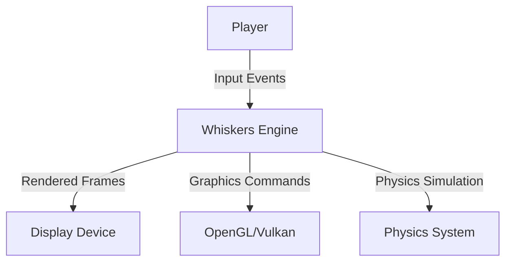
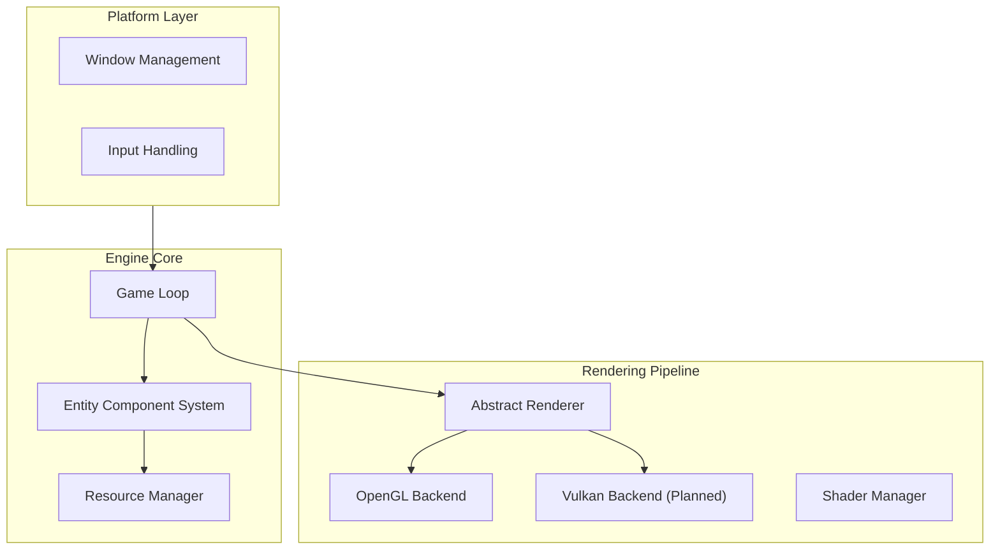

# Whiskers Engine

A modern C++ game engine with dual OpenGL/Vulkan rendering backends, designed for performance and extensibility. Built with ECS architecture and cross-platform compatibility.

## Features

- **Cross-Platform**: macOS, Linux, Windows support
- **Modern Graphics**: OpenGL 3.3 Core → Vulkan migration path
- **ECS Architecture**: Entity-Component-System for flexible game object management
- **Memory Safe**: RAII patterns and smart pointer usage throughout
- **Extensible Rendering**: Plugin-based shader and resource management

## Architecture Overview

### System Context


### Core Components


## Roadmap

### Phase 1: Foundation (Current)
- [x] OpenGL 3.3 Core renderer
- [x] Cross-platform build system (CMake)
- [x] Basic ECS implementation
- [x] SDL2 integration for window/input
- [x] Unit testing framework
- [x] Demo space ship game

### Phase 2: Modern Graphics
- [ ] Vulkan backend implementation
- [ ] Compute shader support
- [ ] Multi-threaded command buffer recording
- [ ] Memory management optimization

### Phase 3: Advanced Features
- [ ] AI-driven procedural content generation
- [ ] Neural network integration (ONNX runtime)
- [ ] Advanced lighting (PBR, ray tracing)
- [ ] Formal verification of critical systems

## Quick Start

### Dependencies

**macOS**
```bash
brew install sdl2 glm glfw cmake pkg-config
```

**Ubuntu/Debian**
```bash
sudo apt update
sudo apt install -y libsdl2-dev libglm-dev libglfw3-dev cmake build-essential pkg-config
```

**Windows (vcpkg)**
```powershell
git clone https://github.com/Microsoft/vcpkg.git
./vcpkg/bootstrap-vcpkg.bat
./vcpkg/vcpkg install sdl2 glm glfw3 --triplet=x64-windows
```

### Build & Run

```bash
# Clone and build
git clone <your-repo>
cd whiskers-engine
mkdir build && cd build
cmake ..
make -j$(nproc)

# Run demo
./whiskers_demo
```

## Development

### Code Style
- Modern C++17/20 features
- RAII and smart pointers for memory management
- Header-only libraries where appropriate
- Consistent naming: `PascalCase` for classes, `snake_case` for functions

### Contributing
1. Fork the repository
2. Create feature branch (`git checkout -b feature/amazing-feature`)
3. Commit changes (`git commit -m 'feat: add amazing feature'`)
4. Push to branch (`git push origin feature/amazing-feature`)
5. Open Pull Request

### Testing
```bash
# Run unit tests
cd build
ctest --verbose

# Run integration tests
./tests/integration_tests
```

## Technical Details

### Graphics Pipeline
- **OpenGL**: 3.3 Core Profile with VAOs/VBOs
- **Shaders**: GLSL 330 with automatic compilation/linking
- **Textures**: STB-based loading with automatic mipmap generation
- **Future**: Vulkan backend for explicit GPU control

### Entity Component System
- **Components**: Plain data structures
- **Systems**: Pure functions operating on component data
- **Entities**: Lightweight ID-based handles
- **Memory**: Contiguous storage for cache efficiency

## License

MIT License - see [LICENSE](LICENSE) for details.

## Acknowledgments

- [GLAD](https://glad.dav1d.de/) for OpenGL loading
- [GLM](https://glm.g-truc.net/) for mathematics
- [SDL2](https://www.libsdl.org/) for platform abstraction